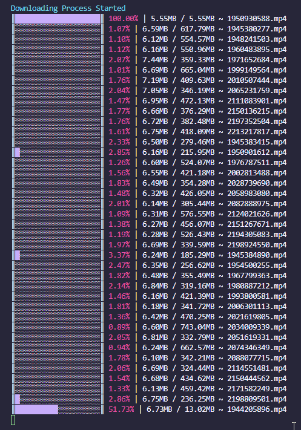

# Vimeo Downloader

### Contextualization

My mother bought a course and wanted to watch it offline. I didn't know how many videos the course had (could be 1 or could be 1000)
**SPOILER: turns out to be 20GBS of videos.**

So, since i was spending part of my vacation on her house, i took my time to develop this short project/script and help her.
There is no such big deal besides downloading videos from vimeo.

I do support teaching computing/coding during the early stages of the life and at school. **I don't** expect to my mother being a able to code this, but i do expect that the upcoming generations can(being almost a natural skill). Learning how to code can make anyone's life simpler and better.

## How it works?
Takes a URL from the VimeoPlayer like **[THIS](https://player.vimeo.com/video/480855401)** and download it.
It supports multiple downloads and show it's progress in the terminal.

## Not so good parts
Unfortunately there are a few hardcoded parts and the terminal flicks often. If you may have something else to add (i don't think you have). Feel free to make MR/PRs. It's far from perfect, but works.

## Preview

